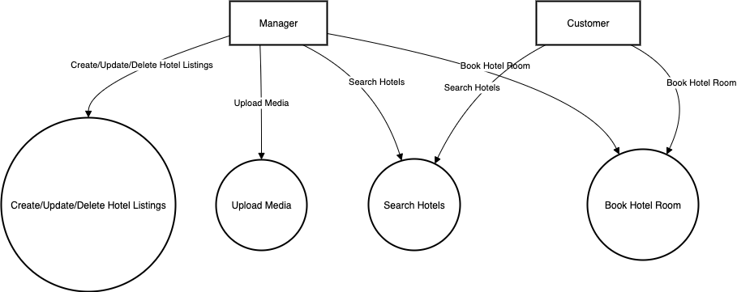

# Requirement Analysis in Software Development.

## Introduction
This repository explores the process of requirement analysis in software development. It serves as a learning project to document the principles, techniques, and examples 
of requirement analysis using a booking management system as a case study.

## What is Requirement Analysis?
The Requirement Analysis Project focuses on crafting a comprehensive foundation for software development by documenting, analyzing, and structuring requirements. 
Requirement Analysis in software developement is the a critical part of software development .Here the team gathers , anlyzes and defines the requirement of sofware to be developed.

## Why is Requirement Analysis Important?
- It provides a clear understanding of what stakeholders expect from the software 
- It also helps define the scope of the software
- It also serves a solid foundation for designing and developing the partiular sofware

## Key Activities in Requirement Analysis.
### Requirement Gathering
This activity focuses on obtaining detailed information about stakeholder needs and expectations. 
Different techniques are used to ensure requirements are accurate and complete:
- **Interviews:** One-on-one discussions to gain deep insights into user needs.  
- **Surveys/Questionnaires:** Collect responses from a wider audience to identify common requirements.  
- **Workshops:** Collaborative sessions to align multiple stakeholders and resolve conflicting needs.  
- **Observation:** Watching users in their environment to uncover unspoken needs and pain points.  
- **Document Analysis:** Reviewing existing systems and records to understand current functionalities.  

### Requirement Elicitation
These methods are used to generate additional ideas, clarify unclear requirements, and refine the system vision.Some techniques used are:
- **Brainstorming**: Conducting idea-generation sessions with stakeholders to capture a wide range of requirements.  
- **Focus Groups**: Holding guided discussions with selected stakeholders to explore requirements in detail.  
- **Prototyping**: Creating early models or mockups of the system to help stakeholders visualize features and refine their needs.

### Requirement Documentation
Once requirements have been gathered and clarified, they must be documented clearly so that all stakeholders and developers share a common understanding.
- **Requirement Specification Document**: A detailed document that lists all **functional** and **non-functional** requirements of the system.  
- **User Stories**: Short, simple descriptions of system features written from the user’s perspective (e.g., *“As a student, I want to reset my password so that I can access my account when I forget it”*).  
- **Use Cases**: Structured descriptions or diagrams showing how users (actors) interact with the system to achieve specific goals.

### Requirement Analysis and Modeling
At this stage, requirements are examined more critically to determine their priority, feasibility, and structure. This ensures the project remains realistic and aligned with business goals.
- **Requirement Prioritization**: Ranking requirements based on importance, urgency, and impact on the project. Helps in deciding which features to implement first.  
- **Feasibility Analysis**: Assessing whether requirements can be implemented given the technical, financial, and time constraints of the project.  
- **Modeling**: Using models (e.g., Data Flow Diagrams, Entity-Relationship Diagrams, Use Case Diagrams) to visualize requirements and analyze how different components of the system will interact.

### Requirement Validation
After analysis and modeling, the refined requirements are brought back to stakeholders for validation. This ensures the documented needs are accurate, feasible, and aligned with stakeholder expectations.
- **Review and Approval**: Going through the documented requirements with stakeholders to confirm accuracy, completeness, and alignment with business objectives.  
- **Acceptance Criteria**: Defining measurable conditions that each requirement must satisfy in order to be considered complete and acceptable.  
- **Traceability**: Creating traceability matrices to map requirements to design, development, and testing stages — ensuring that every requirement is addressed and nothing is overlooked.

## Types of Requirements
### Functional Requirement
Functional requirements define **what the system should do** — the specific features and functions that the system must provide.  

- Hotel managers should be able to **create, update, and delete hotel listings** (rooms, amenities, prices, availability).  
- Managers should be able to **upload media** (photos, videos) for their hotels.  
- Customers should be able to **search hotels** by location, price, availability, or amenities.  
- Customers should be able to **book a hotel room**.  

### Non Functional Requirement
Non-functional requirements describe the quality attributes and constraints of the system.

- The system should handle **thousands of concurrent users** without performance degradation.  
- Search results should load in **less than 2 seconds**.  
- The system should provide **99.9% uptime** with fault tolerance.  
- All transactions should be **encrypted** to ensure security.  
- The app should be accessible on **both mobile and web platforms**.

## What are Use Case Diagrams?
Use Case Diagrams are visual representations that show how different users (called *actors*) interact with a system to achieve specific goals (called *use cases*). They illustrate the system's functionalities and the relationships between users and actions.

---

**Benefits of Use Case Diagrams **
- Provide a clear **visual representation of system functionalities**.  
- Help in **identifying and organizing requirements** effectively.  
- **Facilitate communication** among stakeholders and the development team.

